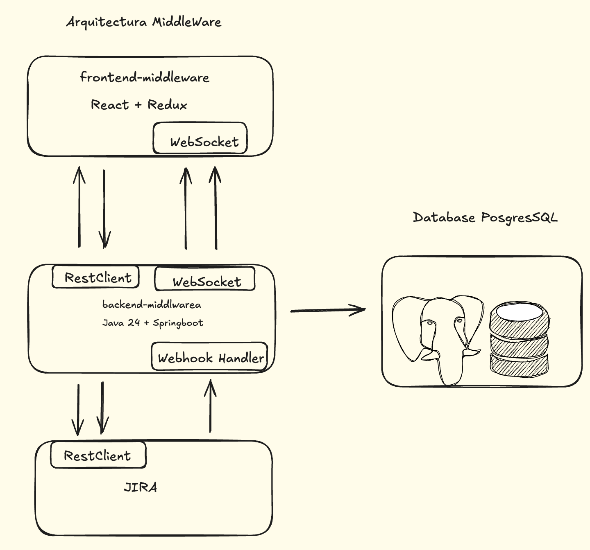
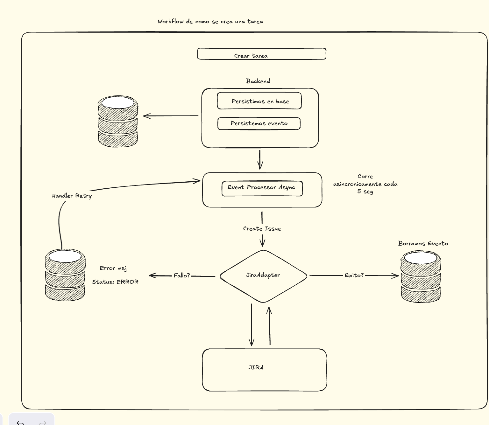

# Middleware Challenge

## 📋 Descripción
Mini Aplicacion para Gestionar Issues, con un frontend muy simple para poder gestionar tareas, comunicacion en tiempo real sobre actualizaciones sobre el gestor de tareas que este integrado, en este caso es JIRA. Como backend la idea es hacer una API middleware que funcione como comunicacion entre el interfaz y JIRA, pero implementado arquitectura hexagonal, para que facilmente se pueda integrar con otro servicio de gestion de Tareas, como MIRO.

## 🏗️ Arquitectura

### Arquitectura Hexagonal (Ports & Adapters)
**Decisión:** Implementación estricta de arquitectura hexagonal.

**Porque elegi esta arquitectura?** 
- **Aislamiento del dominio**: La lógica de negocio permanece independiente de frameworks y servicios externos
- **Testabilidad**: Facilita el testing unitario mediante inyección de dependencias y mocks de puertos
- **Flexibilidad**: Permite cambiar adaptadores (ej: Jira por otro sistema) sin modificar el dominio
- **Mantenibilidad**: Separación clara de responsabilidades facilita la evolución del código

## 🔧 Stack Tecnológico

### Backend

| Tecnología | Versión | Justificación |
|------------|---------|---------------|
| **Java** | 21 | LTS con características modernas (records, pattern matching) |
| **Spring Boot** | 3.5.x | Framework maduro con excelente soporte para arquitectura hexagonal vía inyección de dependencias |
| **PostgreSQL** | 15 | Base de datos relacional para garantizar consistencia ACID en sincronización bidireccional |
| **JPA/Hibernate** | - | Abstracción de persistencia que se alinea con el patrón Repository |
| **Maven** | 3.9.x | Gestión de dependencias estandarizada en el ecosistema Java empresarial |

### Frontend

| Tecnología | Versión | Justificación |
|------------|---------|---------------|
| **React** | 18.x | Framework reactivo para UI dinámica con excelente ecosistema |
| **Redux Toolkit** | 2.x | Gestión de estado predecible con DevTools para debugging |
| **RTK Query** | - | Caching y sincronización de datos con el backend |
| **TypeScript** | 5.x | Type safety para reducir errores en runtime |

### Arquitectura de la aplicacion



## 💡 Decisiones de Diseño


## Como creamos una nueva Issue en base y en JIRA?



### PostgreSQL vs NoSQL
**Elección:** PostgreSQL

**Razones:**
- **Estructura consistente**: Las tareas tienen esquema fijo y relaciones bien definidas
- **Transaccionalidad**: Operaciones ACID críticas para mantener consistencia con Jira
- **Consultas complejas**: SQL facilita reportes y búsquedas avanzadas
- **Integridad referencial**: Constraints para garantizar consistencia de datos

### Sincronización Bidireccional
- **Webhook de Jira**: Recepción de eventos en tiempo real para mantener sincronización
- **Patrón Outbox**: Garantiza eventual consistency en caso de fallos de red

### Patrones Implementados
- **Repository Pattern**: Abstracción de la capa de persistencia
- **Use Case Pattern**: Cada operación de negocio como caso de uso independiente
- **DTO Pattern**: Separación entre modelos de dominio y representaciones externas
- **Mapper Pattern**: Traducción entre entidades de dominio y DTOs

## 🚀 Instalación y Configuración

### Prerrequisitos
```bash
# TODO: Completar con requisitos del sistema
```

### Variables de Entorno
```bash
# TODO: Agregar archivo .env.example
```

### Configuración de Base de Datos
```bash
# TODO: Agregar instrucciones Docker Compose
```

### Ejecución Local
```bash
# TODO: Comandos para levantar la aplicación
```

### Testing
```bash
# TODO: Comandos para ejecutar tests
```

## 🔌 Integración con Jira

### Configuración del Webhook
```bash
# TODO: Instrucciones para configurar webhook con ngrok
```

### API Token
```bash
# TODO: Pasos para obtener token de Jira
```

## 📚 Documentación Adicional

- En proceso

## 👤 Autor
Eric Quevedo

---
