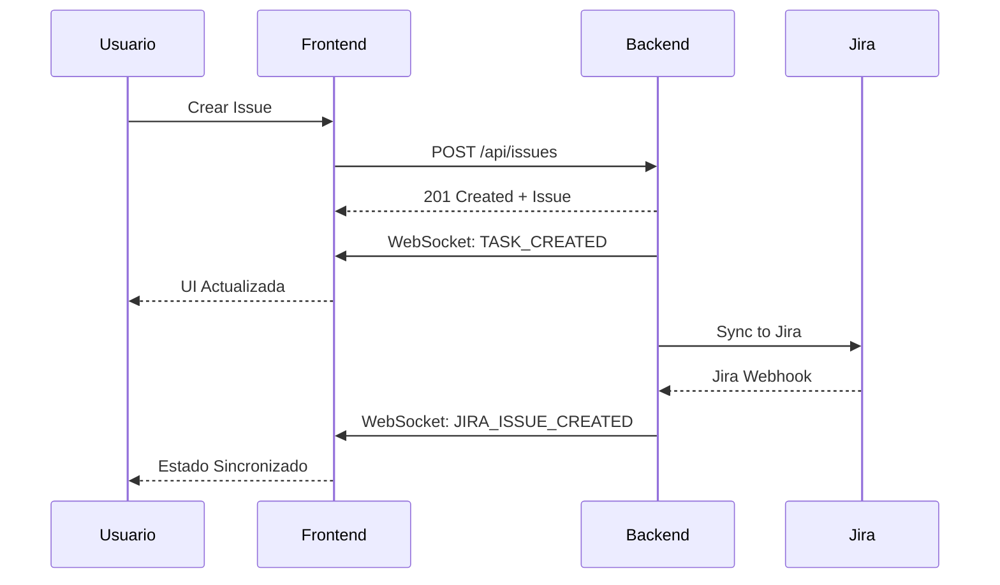

# Backend-Frontend Communication Guide

## 🔄 Arquitectura de Comunicación

El sistema middleware utiliza dos canales principales de comunicación entre el backend (Spring Boot) y el frontend (React):

### 1. **REST API** - Operaciones CRUD Síncronas
### 2. **WebSocket (STOMP)** - Actualizaciones en Tiempo Real

---

## 📡 REST API Communication

### Configuración Base

**Backend:** `http://localhost:8080`  
**Frontend:** `http://localhost:5173`  
**Base URL:** `/api/issues`

### Endpoints Disponibles

| Método | Endpoint | Descripción | Request Body | Response |
|--------|----------|-------------|--------------|----------|
| `GET` | `/api/issues` | Listar todas las issues | - | `Issue[]` |
| `GET` | `/api/issues/{id}` | Obtener issue por ID | - | `Issue` |
| `POST` | `/api/issues` | Crear nueva issue | `CreateIssueRequest` | `Issue` |
| `PATCH` | `/api/issues/{id}` | Actualizar issue | `UpdateIssueRequest` | `Issue` |
| `DELETE` | `/api/issues/{id}` | Eliminar issue | - | `204 No Content` |

### Estructura de Datos

#### Issue Object
```json
{
  "id": "550e8400-e29b-41d4-a716-446655440000",
  "title": "Título de la issue",
  "description": "Descripción detallada",
  "status": "PENDING|IN_PROGRESS|DONE|CANCELLED",
  "createdAt": "2025-01-05T10:30:00.000Z",
  "updatedAt": "2025-01-05T12:45:00.000Z",
  "dueDate": "2025-01-10",
  "priority": "LOW|MEDIUM|HIGH"
}
```

#### Create Issue Request
```json
{
  "title": "Nueva issue",
  "description": "Descripción de la issue",
  "dueDate": "2025-01-10",
  "priority": "MEDIUM"
}
```

#### Update Issue Request
```json
{
  "title": "Título actualizado",
  "description": "Descripción actualizada",
  "status": "IN_PROGRESS",
  "dueDate": "2025-01-15",
  "priority": "HIGH"
}
```

### Manejo de Errores

#### Error Response Format
```json
{
  "timestamp": "2025-01-05T10:30:00.000Z",
  "status": 404,
  "error": "Not Found",
  "message": "Issue not found with id: {id}",
  "path": "/api/issues/{id}"
}
```

#### Códigos de Estado HTTP

- `200 OK` - Operación exitosa
- `201 Created` - Issue creada exitosamente
- `204 No Content` - Issue eliminada exitosamente
- `400 Bad Request` - Datos de entrada inválidos
- `404 Not Found` - Issue no encontrada
- `500 Internal Server Error` - Error interno del servidor

---

## 🔌 WebSocket Communication (STOMP)

### Configuración WebSocket

**Endpoint:** `ws://localhost:8080/ws`  
**Protocolo:** `SockJS + STOMP`  
**Topic:** `/topic/jira-events`

### Configuración Backend

```java
// WebSocketConfig.java
@Configuration
@EnableWebSocketMessageBroker
public class WebSocketConfig implements WebSocketMessageBrokerConfigurer {
    
    @Override
    public void configureMessageBroker(MessageBrokerRegistry config) {
        config.enableSimpleBroker("/topic", "/queue");
        config.setApplicationDestinationPrefixes("/app");
    }
    
    @Override
    public void registerStompEndpoints(StompEndpointRegistry registry) {
        registry.addEndpoint("/ws")
                .setAllowedOriginPatterns("*")
                .withSockJS();
    }
}
```

### Configuración Frontend

```javascript
// ws.js
import { Client } from '@stomp/stompjs'
import SockJS from 'sockjs-client'

const stompClient = new Client({
  webSocketFactory: () => new SockJS('http://localhost:8080/ws'),
  onConnect: () => {
    stompClient.subscribe('/topic/jira-events', handleMessage)
  }
})
```

### Tipos de Eventos WebSocket

#### Formato de Mensaje Unificado
```json
{
  "type": "TASK_CREATED|TASK_UPDATED|TASK_DELETED|JIRA_ISSUE_*",
  "task": {
    "id": "550e8400-e29b-41d4-a716-446655440000",
    "title": "Título de la issue",
    "description": "Descripción",
    "status": "PENDING",
    "createdAt": "2025-01-05T10:30:00.000Z",
    "updatedAt": "2025-01-05T10:30:00.000Z",
    "dueDate": "2025-01-10",
    "priority": "MEDIUM"
  },
  "id": "id-para-eventos-de-eliminación"
}
```

#### Eventos Soportados

1. **`TASK_CREATED`** - Nueva issue creada
   ```json
   {
     "type": "TASK_CREATED",
     "task": { ... }
   }
   ```

2. **`TASK_UPDATED`** - Issue actualizada
   ```json
   {
     "type": "TASK_UPDATED", 
     "task": { ... }
   }
   ```

3. **`TASK_DELETED`** - Issue eliminada
   ```json
   {
     "type": "TASK_DELETED",
     "id": "550e8400-e29b-41d4-a716-446655440000"
   }
   ```

4. **Eventos Jira** - Sincronización con Jira
   - `JIRA_ISSUE_CREATED`
   - `JIRA_ISSUE_UPDATED`
   - `JIRA_ISSUE_DELETED`

### Flujo de Eventos



---

## 🔧 CORS Configuration

### Backend CORS Settings
```java
// CorsConfig.java
@Configuration
public class CorsConfig {
    
    @Bean
    public WebMvcConfigurer corsConfigurer() {
        return new WebMvcConfigurer() {
            @Override
            public void addCorsMappings(CorsRegistry registry) {
                registry.addMapping("/api/**")
                        .allowedOrigins("http://localhost:5173", "http://localhost:3000")
                        .allowedMethods("GET", "POST", "PUT", "PATCH", "DELETE", "OPTIONS")
                        .allowedHeaders("*")
                        .allowCredentials(true);
                
                registry.addMapping("/ws/**")
                        .allowedOrigins("http://localhost:5173", "http://localhost:3000")
                        .allowCredentials(true);
            }
        };
    }
}
```

---

## 🎯 Frontend Integration

### API Service Layer

```javascript
// api.js
const API_BASE_URL = 'http://localhost:8080'

export const api = {
  // GET /api/issues
  getTasks: async () => {
    const response = await apiClient.get('/api/issues')
    return response.data
  },
  
  // POST /api/issues
  createTask: async (taskData) => {
    const dataWithDefaults = {
      priority: 'MEDIUM',
      ...taskData
    }
    const response = await apiClient.post('/api/issues', dataWithDefaults)
    return response.data
  },
  
  // PATCH /api/issues/{id}
  updateTask: async (id, taskData) => {
    const response = await apiClient.patch(`/api/issues/${id}`, taskData)
    return response.data
  },
  
  // DELETE /api/issues/{id}
  deleteTask: async (id) => {
    await apiClient.delete(`/api/issues/${id}`)
  }
}
```

### WebSocket Integration

```javascript
// ws.js
export const connectWebSocket = (dispatch) => {
  const stompClient = new Client({
    webSocketFactory: () => new SockJS('http://localhost:8080/ws'),
    
    onConnect: () => {
      stompClient.subscribe('/topic/jira-events', (message) => {
        const data = JSON.parse(message.body)
        
        switch (data.type) {
          case 'TASK_CREATED':
          case 'TASK_UPDATED':
            dispatch(upsertFromWs(data.task))
            break
            
          case 'TASK_DELETED':
            dispatch(removeFromWs(data.id))
            break
            
          case 'JIRA_ISSUE_CREATED':
          case 'JIRA_ISSUE_UPDATED':
          case 'JIRA_ISSUE_DELETED':
            dispatch(fetchTasks()) // Refresh from server
            break
        }
      })
    }
  })
  
  stompClient.activate()
}
```

### Redux Integration

```javascript
// issuesSlice.js
export const issuesSlice = createSlice({
  name: 'issues',
  initialState: { items: [], loading: false, error: null },
  
  reducers: {
    upsertFromWs: (state, action) => {
      const issue = action.payload
      const index = state.items.findIndex(item => item.id === issue.id)
      
      if (index !== -1) {
        state.items[index] = issue // Update existing
      } else {
        state.items.push(issue) // Add new
      }
    },
    
    removeFromWs: (state, action) => {
      const id = action.payload
      state.items = state.items.filter(item => item.id !== id)
    }
  }
})
```

---

## 🔍 Debugging & Monitoring

### Backend Logging

```yaml
# application.yml
logging:
  level:
    com.acme.middleware: INFO
    org.springframework.web: DEBUG
    org.springframework.messaging: DEBUG
```

### Frontend Debugging

```javascript
// Enable WebSocket debugging
stompClient = new Client({
  debug: (str) => console.log('STOMP Debug:', str),
  // ... other config
})

// Monitor API calls
apiClient.interceptors.request.use((config) => {
  console.log('API Request:', config.method.toUpperCase(), config.url)
  return config
})
```

### Common Debug Commands

```bash
# Check backend health
curl http://localhost:8080/actuator/health

# Test WebSocket connection
wscat -c ws://localhost:8080/ws

# Monitor network in browser DevTools
# Network Tab -> Filter by WS (WebSocket)
```

---

## 📊 Performance Considerations

### REST API Optimization

- **Connection Pooling**: Configurado automáticamente por Spring Boot
- **Response Compression**: Habilitado para responses > 2KB  
- **Timeout Configuration**: 10 segundos por request
- **Rate Limiting**: Implementar según necesidades de producción

### WebSocket Optimization

- **Heartbeat**: 4 segundos (configurable)
- **Reconnection**: Automática con backoff exponencial
- **Message Batching**: Para múltiples updates simultáneos
- **Connection Limits**: Monitorear conexiones simultáneas

### Frontend Optimization

- **Request Debouncing**: Para updates frecuentes
- **State Normalization**: Redux state normalizado por ID
- **WebSocket Throttling**: Limitar updates de UI muy frecuentes
- **Error Boundaries**: Manejo robusto de errores de conexión

---

## ✅ Production Checklist

### Backend
- [ ] Configurar HTTPS en producción
- [ ] Implementar autenticación JWT
- [ ] Configurar rate limiting
- [ ] Activar métricas de Actuator
- [ ] Configurar logging estructurado
- [ ] Implementar health checks

### Frontend
- [ ] Configurar variables de entorno de producción
- [ ] Implementar retry logic para API calls
- [ ] Añadir loading states y error handling
- [ ] Configurar service worker para offline support
- [ ] Implementar analytics y monitoring

### Integration
- [ ] Implementar circuit breakers
- [ ] Configurar monitoring de WebSocket connections
- [ ] Añadir integration tests automatizados
- [ ] Configurar alertas de desconexión
- [ ] Implementar graceful degradation

---

## 🚀 Resultado Final

Después de aplicar todas las correcciones:

✅ **REST API**: Frontend se comunica correctamente con `/api/issues`  
✅ **WebSocket**: Eventos en tiempo real funcionan via `/topic/jira-events`  
✅ **Data Flow**: Estructura de datos consistente sin transformaciones  
✅ **Error Handling**: Manejo robusto de errores y reconexiones  
✅ **CORS**: Configuración correcta para desarrollo y producción

La integración backend-frontend ahora es **completamente funcional** y está lista para desarrollo y producción.